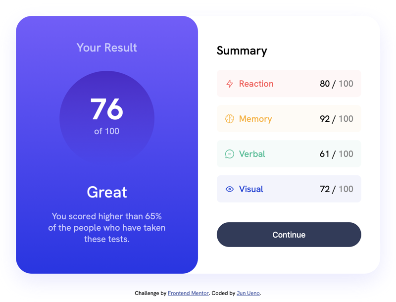

# Frontend Mentor - Results summary component solution

This is a solution to the [Results summary component challenge on Frontend Mentor](https://www.frontendmentor.io/challenges/results-summary-component-CE_K6s0maV). Frontend Mentor challenges help you improve your coding skills by building realistic projects.

## Table of contents

- [Overview](#overview)
  - [The challenge](#the-challenge)
  - [Screenshot](#screenshot)
  - [Links](#links)
- [My process](#my-process)
  - [Built with](#built-with)
  - [What I learned](#what-i-learned)
  - [Continued development](#continued-development)
- [Author](#author)

**Note: Delete this note and update the table of contents based on what sections you keep.**

## Overview

### The challenge

Users should be able to:

- View the optimal layout for the interface depending on their device's screen size
- See hover and focus states for all interactive elements on the page

### Screenshot



### Links

- Solution URL: [Add solution URL here](https://github.com/Jun-Ueno/results-summary-component)
- Live Site URL: [Add live site URL here](https://jun-ueno.github.io/results-summary-component/)

## My process

### Built with

- CSS custom properties
- Flexbox
- CSS Grid
- Mobile-first workflow

### What I learned

For this project I mainly focused on using CSS Grid. Flexbox has become my default goto layout tool, but grid is generally more precise especially with 2-column setups with equal widths.

```css
.container {
  display: grid;
  grid-template-columns: 1fr 1fr;
  max-width: 740px;
}
@media screen and (max-width: 480px) {
  .container {
    grid-template-columns: auto;
    grid-template-rows: 1fr auto;
  }
}
```

An area I had trouble with is vertically aligning the icons and text in the Summary section. On the inline image, I used a negative vertical-align to push the icons down but it has the potential of pushing down the left column text so it doesn't align with the right side. There's probably a better solution.

```html
<div class="summary-row row-1">
  <p class="col-1">Reaction</p>
  <p class="col-2">80 / <span class="out-of">100</span></p>
</div>
```

```css
.summary .summary-row img {
  height: 1.25rem;
  vertical-align: -0.25rem;
  margin-right: 0.6rem;
}
```

### Continued development

I have some Javascript written to ingest the JSON file and save it as an array. In the future I will write the code to make the Summary data dynamic.

## Author

- Frontend Mentor - [@Jun-Ueno](https://www.frontendmentor.io/profile/Jun-Ueno)
- LinkedIn - [@jun-ueno-5a558163](https://www.linkedin.com/in/jun-ueno-5a558163/)
